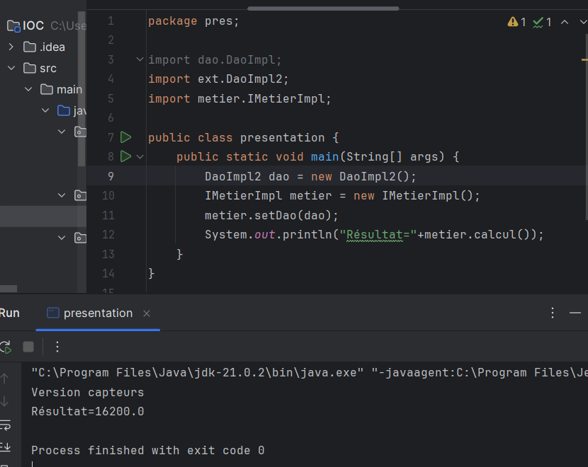

<h1>Injection de dependance</h1>

Notre objectif est de créer une application fermée 
    à la modification et ouverte à l'extension.

Lors de l'execution de la classe presentation une exception se presente car nous
   faisons appelle à la methode d'un objet qui n'est pas créer

L'origine de l'exception provient de la methode calcul

Pour remedier à cela il faut une injection de dependances en créant
    tout d'abord un objet de type DaoImpl puis faire l'injection en utilisant
     le setup et lui donner comme parametre dao

Resultat apres injection des dependances

Alors ici nous remarquons que la couche "presentation" n'est 
   ni ouverte à l'extention ni fermée à la modification car nous avons 
    utilisé le couplage fort  
    Alors nous allons utilisé la version capteurs en créant
  une nouvelle classe dans un package nommée extension par exemple
   pour qu'elle implémente l'interface IDao

 

Maintenant nous voulant que notre application utilise cette version
  au lieu de l'autre.  
   Alors nous allons devoir faire des modification dans la couche présentation
 pour que ça fonctionne

Notre application n'est toujours pas fermée à la modification.
 Mais nous voulons que notre application soit totalement fermée ç la 
 la modification et ouverte à l'extension sans utuliser des Framework
    
 Pour cela nous devons faire l'instanciation dynamique su lieu de statique
en créant une nouvelle couche appelée "presentation2" qui va
 passer un fichier de configuration nommé config.txt, pour utiliser la version de base de données

Pour utiliser la version capteurs nous n'avons juste qu'à
 modifier le fichier config

Nous allons maintenant ajouter la classe Metier

 